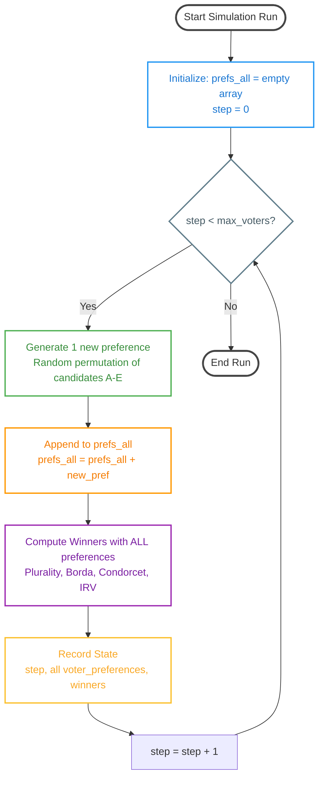
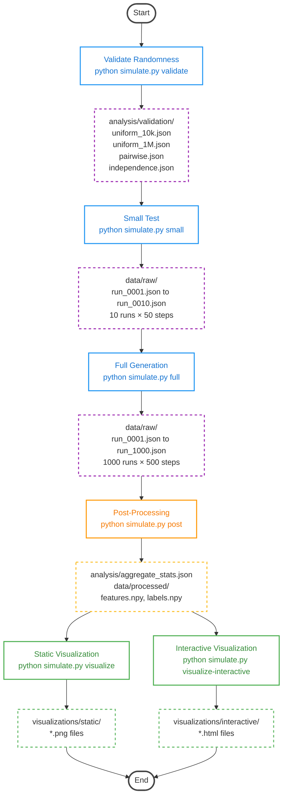

# Arrow Voting Simulator

A comprehensive simulation system for progressive election analysis under multiple voting rules.

This project simulates rolling elections with 5 candidates (A–E), generating per-step outcomes for multiple voting rules to produce ML-ready datasets.

## Components
- Preference Generator: uniform permutations over 5 candidates.
- Voting Rules: Plurality, Borda (4-3-2-1-0), Condorcet, IRV/Hare.
- Progressive Engine: adds one voter at a time up to `n_max` per run.
- Data Recorder: writes per-run JSON in `data/raw`.
- Statistical Validator: randomness tests and aggregate analyses.
- Visualization Pipeline: generates static plots for winner evolution, distributions, rule agreement, and Condorcet rates.
- Interactive Visualization Pipeline: generates interactive Plotly plots in separate subfolder for zoom, hover, and exploration.

## Tiebreaking Rule
Deterministic alphabetical order (A < B < C < D < E). When scores tie, the lower index wins.

## Reproducibility
All runs can be seeded with `--seed`. Given the same seed, results are deterministic.

## Progressive Simulation Algorithm

The core algorithm accumulates voters progressively, recalculating winners at each step with all previous voters' preferences preserved:



**Key Points:**
- Each step adds exactly **one new voter** to the accumulated set
- All **previous preferences are preserved** (never modified or removed)
- Winners are **recalculated from scratch** at each step using the full accumulated preference matrix
- This creates a progressive view of how winners change as more voters participate

## Pipeline Flow



## Usage
1. Install dependencies:
```bash
pip install -r requirements.txt
```
2. Validate randomness and rules:
```bash
python simulate.py validate --quick
```
3. Small-scale test (10 runs × 50 steps):
```bash
python simulate.py small --seed 42
```
4. Full generation (1000 runs × 500 steps):
```bash
python simulate.py full --seed 42
```
5. Post-process aggregate stats and simple features/labels:
```bash
python simulate.py post
```
6. Generate static visualizations:
```bash
python simulate.py visualize
```
7. Generate interactive Plotly visualizations (in separate subfolder):
```bash
python simulate.py visualize-interactive
```
You can specify which runs to visualize: `python simulate.py visualize-interactive --runs 1 2 3 4 5`

## Outputs

**Note**: The following directories are automatically created when you run the simulation commands. They are not included in the git repository but will be generated locally.

### Data Directory (`data/`)
Created by: `python simulate.py small` or `python simulate.py full`
- `data/raw/run_XXXX.json`: Individual simulation run records (1000 files)
- `data/processed/`: ML-ready processed data (created by `python simulate.py post`)
  - `features.npy`: Input features for machine learning
  - `labels.npy`: Target labels (winners)
  - `metadata.json`: Data format documentation

### Analysis Directory (`analysis/`)
Created by: `python simulate.py validate` and `python simulate.py post`
- `analysis/validation/`: Randomness validation tests
  - `uniform_10k.json`: Uniformity test (10k samples)
  - `uniform_1M.json`: Uniformity test (1M samples)
  - `pairwise.json`: Pairwise balance test
  - `independence.json`: Independence test
- `analysis/aggregate_stats.json`: Summary statistics across all runs

### Visualizations Directory (`visualizations/`)
Created by: `python simulate.py visualize` and `python simulate.py visualize-interactive`
- `visualizations/static/`: Static PNG plots
  - `winner_evolution.png`: Winner changes over steps
  - `winner_distribution.png`: Winner frequency by candidate
  - `rule_agreement_heatmap.png`: Rule agreement matrix
  - `winner_changes.png`: Change frequency analysis
  - `condorcet_rate.png`: Condorcet winner rate
- `visualizations/interactive/`: Interactive Plotly HTML plots
  - `winner_evolution_interactive.html` - Interactive winner evolution
  - `winner_aggregation_interactive.html` - Winner distribution by voter count
  - `condorcet_rate_interactive.html` - Interactive Condorcet rate plot
  - `winner_distribution_interactive.html` - Interactive bar charts
  - `rule_agreement_heatmap_interactive.html` - Interactive agreement heatmap
  - `winner_changes_interactive.html` - Interactive change frequency
  - `dashboard.html` - Combined dashboard view

## Notes
- Memory: preferences are stored as integers (0–4). Engine writes incrementally to limit memory usage.
- Resume: by default, existing run files are skipped during `full` to allow resuming.
- Performance: for Windows, parallelization is not enabled by default to keep compatibility. Can be added per-need.
